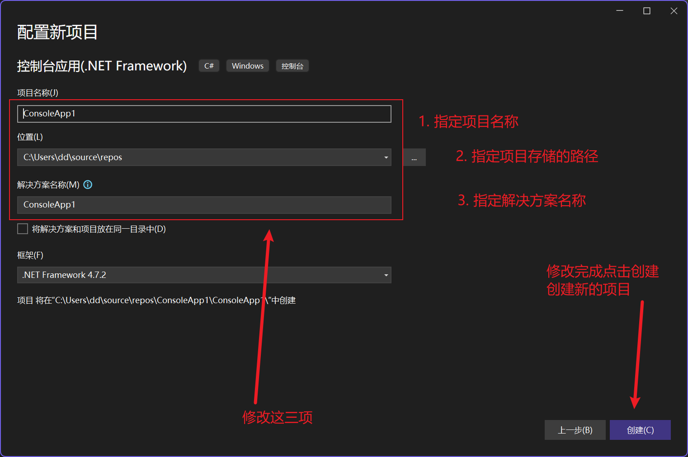

# 02-cSharp基础

C sharp(又被简称为“C\#”)是微软公司在发布的一种新的编程语言,并定于在微软职业开发者论坛(PDC)上登台亮相.C是微软公司研究员Anders Hejlsberg的最新成果.C\#看起来与Java有着惊人的相似;它包括了诸如单一继承,界面,与Java几乎同样的语法,和编译成中间代码再运行的过程.但是C与Java有着明显的不同,它借鉴了Delphi的一个特点,与COM(组件对象模型)是直接集成的,而且它是微软公司.NET windows网络框架的主角.

## 第一个项目

### 1. 创建项目

1. 打开visual studio 并创建新项目

   
2. 选择指定的模板

   
3. 配置项目名称解决方案名称以及项目存储的路径

   
4. 项目创建完成之后即可编辑代码了

   

### 2. 程序编辑

通过上面的操作我们已经将项目创建完成了，接下来就可以书写代码了！

将下面的代码添加到你的程序中

```C#
// 主函数 程序从这里开始执行
 static void Main(string[] args)
 {
     // 在控制台打印一行文本
     Console.WriteLine("hellow world");
     // 程序运行结束控制台会关闭

     // 用来读取用户输入的内容 
     Console.ReadLine(); // 只有当用户输入完成敲击回车键时这句代码才会执行完成

     // 我们可以 利用 Console.ReadLine(); 等待用户输入的特点。来防止控制台关闭 

 }
```

上面的代码书写完成就可以启动程序了 你会在控制台看到 `hello world`​ 的输出

## 注释

注释用于解释代码的功能、目的或算法逻辑，提高代码的可读性。编程语言中的注释不会被计算机编译执行，但有助于开发者和其他阅读代码的人理解代码的意图和功能。

简单理解，注释的目的是为了对代码进行解释说明，让程序员更容易看懂和理解代码。

在C#中注释有三种类型：

1. 单行注释：以两个正斜杠 // 开始，其后的所有文本都是注释。
   示例

   ```C#
   // 注释的代码
   ```
2. 多行注释：以 /\* 开始，以 \*/ 结束。
   示例

   ```C#
   /*
       注释的代码
       可以是多行代码
   */ 
   ```
3. XML 文档注释：以 /// 开始，用于为代码生成文档。
   示例

   ```C#
   /// <summary>
   /// XML 文档注释用于提供代码的文档说明。
   /// </summary>
   public class MyClass
   {
       // 类成员
   }
   ```

## 快捷键

注释快捷键： `ctrl + k + c`​

取消注释快捷键：`ctrl + k + u`​

快速格式化快捷键：`ctrl + k + d`​

撤回快捷键：`ctrl + z`​

反向撤回快捷键：`ctrl + shift + z`​


